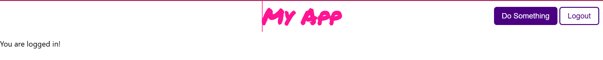

# TaskFlow API — Session-Auth Productivity Backend

## Project Description

TaskFlow is a secure RESTful Flask API that powers a personal task-tracking
productivity app. It implements full **cookie/session-based authentication**
(sign up, log in, log out, and session persistence via `check_session`) and
exposes a **user-owned `Task` resource** with complete CRUD, ownership
enforcement, and pagination.

It is designed to work with the **`client-with-sessions`** React frontend
included in this repository (not `client-with-jwt` — that client expects a
different, token-based auth flow this backend does not implement). No
frontend code was written as part of this lab, but every endpoint the
sessions client expects (`/signup`, `/login`, `/logout`, `/check_session`) is
implemented and returns the exact shapes the client consumes.

> **Demo login:** username `demo`, password `password123` (created by
> `seed.py` — see [Backend Setup](#backend-setup) below).

### Features

- Secure password storage with **bcrypt** (`flask-bcrypt`) — plaintext
  passwords are never stored or returned.
- **Unique, validated usernames** enforced at both the model and database
  level.
- Session-based auth using Flask's signed cookie session (`session['user_id']`).
- A `Task` model owned by `User` (one-to-many) with four custom fields:
  `description`, `priority`, `completed`, and `due_date` (in addition to
  `title`).
- Full CRUD for tasks: `GET`, `POST`, `PATCH`, `DELETE`.
- **Ownership protection** — a logged-in user can only view, edit, or delete
  their own tasks; attempting to access another user's task returns `404`.
- **Pagination** on the tasks index route via `?page=` and `?per_page=` query
  params.
- Marshmallow-based request validation with clear `422` error payloads.
- `seed.py` populates the database with demo users and randomized tasks
  (via `Faker`).
- Automated test suite (`pytest`) covering auth flow, CRUD, ownership, and
  pagination.

---

## Tech Stack

- Python 3.11 / Flask 2.2.2
- Flask-SQLAlchemy 3.0.3 + Flask-Migrate 4.0.0 (SQLite by default)
- Flask-RESTful 0.3.9
- Flask-Bcrypt 1.0.1
- Marshmallow 3.20.1
- Faker 15.3.2 (seeding)
- Pytest 7.2.0 (testing)

---

## Contents

- [Backend Setup](#backend-setup)
- [Running the Backend](#running-the-backend)
- [Frontend Setup (client-with-sessions)](#frontend-setup-client-with-sessions)
- [Running Everything Together](#running-everything-together)
- [Running Tests](#running-tests)
- [Endpoints](#endpoints)
- [Project Structure](#project-structure)

---

## Backend Setup

All backend commands below are run from the `server/` directory:

```bash
cd server
```

```bash
pipenv install
pipenv shell
```

> Prefer plain `pip` / don't have `pipenv`? You can instead do:
>
> **macOS / Linux:**
> ```bash
> python3 -m venv venv
> source venv/bin/activate
> pip install flask==2.2.2 flask-sqlalchemy==3.0.3 werkzeug==2.2.2 \
>     marshmallow==3.20.1 faker==15.3.2 flask-migrate==4.0.0 \
>     flask-restful==0.3.9 flask-bcrypt==1.0.1 flask-cors pytest
> ```
>
> **Windows (PowerShell):**
> ```powershell
> python -m venv venv
> venv\Scripts\activate
> pip install flask==2.2.2 flask-sqlalchemy==3.0.3 werkzeug==2.2.2 marshmallow==3.20.1 faker==15.3.2 flask-migrate==4.0.0 flask-restful==0.3.9 flask-bcrypt==1.0.1 flask-cors pytest
> ```
> If activation fails with a "running scripts is disabled" error, run this
> once first: `Set-ExecutionPolicy -Scope CurrentUser -ExecutionPolicy RemoteSigned`
>
> Note: this project pins older package versions (Flask 2.2.2, Werkzeug
> 2.2.2). They work reliably on **Python 3.11 or 3.12**. Very new Python
> versions (3.14+) can fail with internal `ast` errors from Werkzeug — if you
> hit that, install Python 3.12 alongside your existing version and create
> the virtual environment with it instead (e.g. `py -3.12 -m venv venv`).

### Set up the database

**macOS / Linux:**
```bash
export FLASK_APP=app.py
flask db init      # only needed if the migrations/ folder isn't already present
flask db upgrade
python seed.py
```

**Windows (PowerShell):**
```powershell
$env:FLASK_APP = "app.py"
flask db init       # only needed if the migrations/ folder isn't already present
flask db upgrade
python seed.py
```

This creates `app.db` (SQLite) with 5 seeded users — including a predictable
`demo` / `password123` account — and several randomized tasks per user.

---

## Running the Backend

**macOS / Linux:**
```bash
export FLASK_APP=app.py
flask run --port 5555
```
or simply: `python app.py`

**Windows (PowerShell):**
```powershell
$env:FLASK_APP = "app.py"
flask run --port 5555
```
or simply: `python app.py`

The API will be available at `http://127.0.0.1:5555`. Leave this terminal
running — you'll need a second one for the frontend.

---

## Frontend Setup (client-with-sessions)

The `client-with-sessions/` folder (at the repo root, alongside `server/`)
is a pre-built React app that already knows how to call this API — no
frontend code needs to be written or modified.

Open a **second terminal** (keep the backend running in the first one) and
run:

```bash
cd client-with-sessions
npm install
npm start
```

This starts the React dev server on **port 4000** (set via the `PORT`
env var in its `package.json` `start` script) and opens
`http://localhost:4000` in your browser. Its `package.json` already has
`"proxy": "http://localhost:5555"` configured, so all of its `fetch("/login")`,
`fetch("/signup")`, `fetch("/check_session")`, etc. calls are automatically
forwarded to your Flask server — no extra configuration needed.

> **Windows note:** if `npm start` fails with `'PORT' is not recognized as an
> internal or external command`, that's because the script uses Unix-style
> env var syntax (`PORT=4000 react-scripts start`), which PowerShell/cmd
> doesn't understand. Fix it one of these ways:
> - Run `$env:PORT = 4000` then `npm start` in PowerShell, **or**
> - Install `cross-env` (`npm install --save-dev cross-env`) and change the
>   `start` script in `client-with-sessions/package.json` to
>   `"cross-env PORT=4000 react-scripts start"`, **or**
> - Just run `npx react-scripts start` to use the default port 3000 instead.

Once both servers are running, log in at `http://localhost:4000` (or
`:3000`, depending on which option above you used) with:

```
username: demo
password: password123
```

Successful login looks like this — the navbar renders with a working
**Logout** button, and the page confirms you're authenticated:



---

## Running Everything Together

A quick recap of the full local setup, start to finish:

1. **Terminal 1 — backend:**
   ```bash
   cd server
   # activate your venv/pipenv shell, then:
   flask db upgrade
   python seed.py       # only needed once, or whenever you want fresh demo data
   python app.py
   ```
2. **Terminal 2 — frontend:**
   ```bash
   cd client-with-sessions
   npm install
   npm start
   ```
3. Open the printed frontend URL in your browser and log in with the demo
   credentials above.

---

## Running Tests

From `server/`, with your virtual environment active:

```bash
pytest -v
```

---

## Endpoints

### Auth

| Method | Route            | Description                                                                 | Auth required |
|--------|------------------|-------------------------------------------------------------------------------|:---:|
| POST   | `/signup`        | Create a new user. Body: `{ username, password, password_confirmation }`. Logs the user in (sets session) and returns the user. `201` on success, `422` on validation errors (duplicate username, mismatched passwords, etc). | No |
| POST   | `/login`         | Authenticate a user. Body: `{ username, password }`. Returns the user and sets the session cookie. `200` on success, `401` on invalid credentials. | No |
| DELETE | `/logout`        | Clears the current session. `204` on success, `401` if no user was logged in. | Yes |
| GET    | `/check_session` | Returns the currently logged-in user (used on app load / refresh to restore session). `200` if logged in, `401` otherwise. | Yes |

### Tasks (user-owned resource)

| Method | Route          | Description                                                                                     | Auth required |
|--------|----------------|---------------------------------------------------------------------------------------------------|:---:|
| GET    | `/tasks`       | Returns a **paginated** list of the current user's tasks only. Query params: `page` (default `1`), `per_page` (default `10`, max `100`). Response: `{ tasks: [...], meta: { page, per_page, total, total_pages, has_next, has_prev } }`. | Yes |
| POST   | `/tasks`       | Create a new task owned by the current user. Body: `{ title, description?, priority?, completed?, due_date? }`. `201` on success, `422` on validation errors. | Yes |
| GET    | `/tasks/<id>`  | Return a single task. `404` if the task doesn't exist or isn't owned by the current user.       | Yes |
| PATCH  | `/tasks/<id>`  | Partially update a task (any subset of `title`, `description`, `priority`, `completed`, `due_date`). `404` if not owned by the current user, `422` on validation errors. | Yes |
| DELETE | `/tasks/<id>`  | Delete a task. `204` on success, `404` if not owned by the current user.                        | Yes |

**Task fields:** `id`, `title`, `description`, `priority` (`low` / `medium` /
`high`), `completed` (bool), `due_date` (`YYYY-MM-DD`), `created_at`,
`updated_at`, `user_id`.

**Demo credentials (after seeding):** `username: demo`, `password: password123`

---

## Project Structure

```
.
├── README.md                    # This file
├── server/                       # Flask API (this project's deliverable)
│   ├── app.py                       # Entry point — registers routes, runs the dev server
│   ├── config.py                     # Flask app, SQLAlchemy, Migrate, Bcrypt, Api, CORS setup
│   ├── models.py                      # User and Task SQLAlchemy models
│   ├── schemas.py                      # Marshmallow request-validation schemas
│   ├── decorators.py                    # @login_required auth decorator
│   ├── resources/
│   │   ├── auth.py                        # SignUp, Login, Logout, CheckSession
│   │   └── tasks.py                        # TaskList (index/create + pagination), TaskDetail (show/update/delete)
│   ├── seed.py                          # Database seeding script
│   ├── migrations/                       # Flask-Migrate/Alembic migrations
│   ├── tests/
│   │   ├── conftest.py                     # Pytest fixtures (in-memory test DB)
│   │   └── test_app.py                      # Auth + Task endpoint test suite
│   └── Pipfile
├── client-with-sessions/          # Pre-built React frontend — USE THIS ONE (matches this backend)
└── client-with-jwt/                # Pre-built React frontend for a JWT-based backend — NOT used here
```
